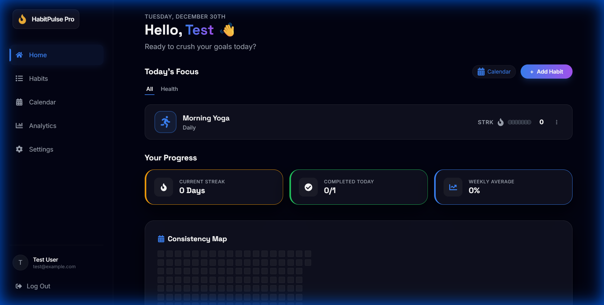

# HabitPulse Pro

> A modern, premium habit tracker for building consistent daily routines with streaks and analytics.


## Project Description

**HabitPulse Pro** is a comprehensive web application designed to help users track their daily habits, maintain streaks, and visualize their progress over time. In a world of scattered to-do lists and disconnected goals, HabitPulse Pro provides a unified, beautiful dashboard for all your daily and weekly routines.

We built this project to combine the performance of **React** + **Vite** with the robust backend capabilities of **Supabase**. It differs from other trackers by focusing heavily on **User Experience (UX)**—featuring a polished "Moon" inspired dark theme, glassmorphism cards, scrollable category tabs, and smooth animations found in premium apps.

**Key Highlights:**
*   **Live Interactions:** Fire flicker animations and personalized hover glows.
*   **Visual Feedback:** 2-second glow when clicking a habit and 7-dot progress tracking (gray=incomplete, green=completed).
*   **Design:** Mobile-first, responsive interface with a curated dark palette and glassmorphism effects.

## Table of Contents

*   [Features](#features)
*   [Tech Stack](#tech-stack)
*   [Installation & Setup](#installation--setup)
*   [Usage](#usage)
*   [Screenshots](#screenshots)
*   [Contributing](#contributing)
*   [Credits](#credits)
*   [License](#license)

## Features

### Core Capabilities
✅ **Today's Focus** + scrollable categories (All/Learning/Relationships/Mindfulness/Productivity/Health)
✅ **Habit cards** w/ user-selected icons + colors
✅ **7-dot Mon-Sun progress** (gray○ → green● on click)
✅ **STRK fire** + live count

### Premium Interactions
✅ Fire flicker animation (continuous)
✅ Row hover = habit color glow
✅ 2sec personalized glow on dot click (mark/unmark)
✅ Staggered page load animations
✅ Perfect mobile→desktop responsive

## Tech Stack

*   **Frontend**: React 18 + Vite ⚡
*   **Styling**: Tailwind CSS 3.4 (custom animations: fireFlicker, dynamic shadows)
*   **Icons**: Lucide React Icons (premium stroke icons)
*   **Utilities**: clsx + cn() (conditional classes)
*   **Backend**: Supabase ready (future auth/backend)

## Installation & Setup

Follow these steps to get the project running on your local machine.

### Prerequisites
*   Node.js (v18 or higher)
*   npm (or pnpm/yarn)
*   A Supabase account

### Steps

1.  **Clone the Repository**
    ```bash
    git clone https://github.com/your-username/habit-pulse-pro.git
    cd habit-pulse-pro
    ```

2.  **Install Dependencies**
    ```bash
    npm install
    ```

3.  **Supabase Configuration**
    *   Create a new project on [Supabase](https://supabase.com).
    *   Go to **Authentication** settings and enable "Email Provider".
    *   Run the migration scripts (found in `migrations/`) in the Supabase SQL Editor to create the necessary tables:
        *   `profiles`
        *   `habits`
        *   `habit_completions`

4.  **Environment Variables**
    Create a `.env.local` file in the root directory and add your keys:
    ```env
    VITE_SUPABASE_URL=your_project_url_here
    VITE_SUPABASE_ANON_KEY=your_anon_key_here
    ```

5.  **Run Development Server**
    ```bash
    npm run dev
    ```
    The app should now be running at `http://localhost:5173`.

## Usage

1.  **View "Today's Focus" dashboard**.
2.  **Hover rows** to see habit color glows.
3.  **Click dots** (gray○ → green●) and enjoy the 2sec glow.
4.  **Scroll category tabs** (All/Learning/etc.) to filter your view.

## Screenshots



## Credits

This project makes use of several open-source libraries and resources:

*   **[React Icons](https://react-icons.github.io/react-icons/)**: For the diverse icon set.
*   **[Recharts](https://recharts.org/)**: For the beautiful analytics charts.
*   **[Supabase](https://supabase.com/)**: For the incredible backend-as-a-service platform.
*   **[Tailwind CSS](https://tailwindcss.com/)**: For rapid UI development.

## Contributing

Contributions are welcome! If you'd like to improve HabitPulse Pro:

1.  Fork the repository.
2.  Create a new branch (`git checkout -b feature/AmazingFeature`).
3.  Commit your changes (`git commit -m 'Add some AmazingFeature'`).
4.  Push to the branch (`git push origin feature/AmazingFeature`).
5.  Open a Pull Request.

Please ensure your code follows the existing style (TypeScript, functional components).

## License

This project is licensed under the MIT License. See the [LICENSE](LICENSE) file for details.
